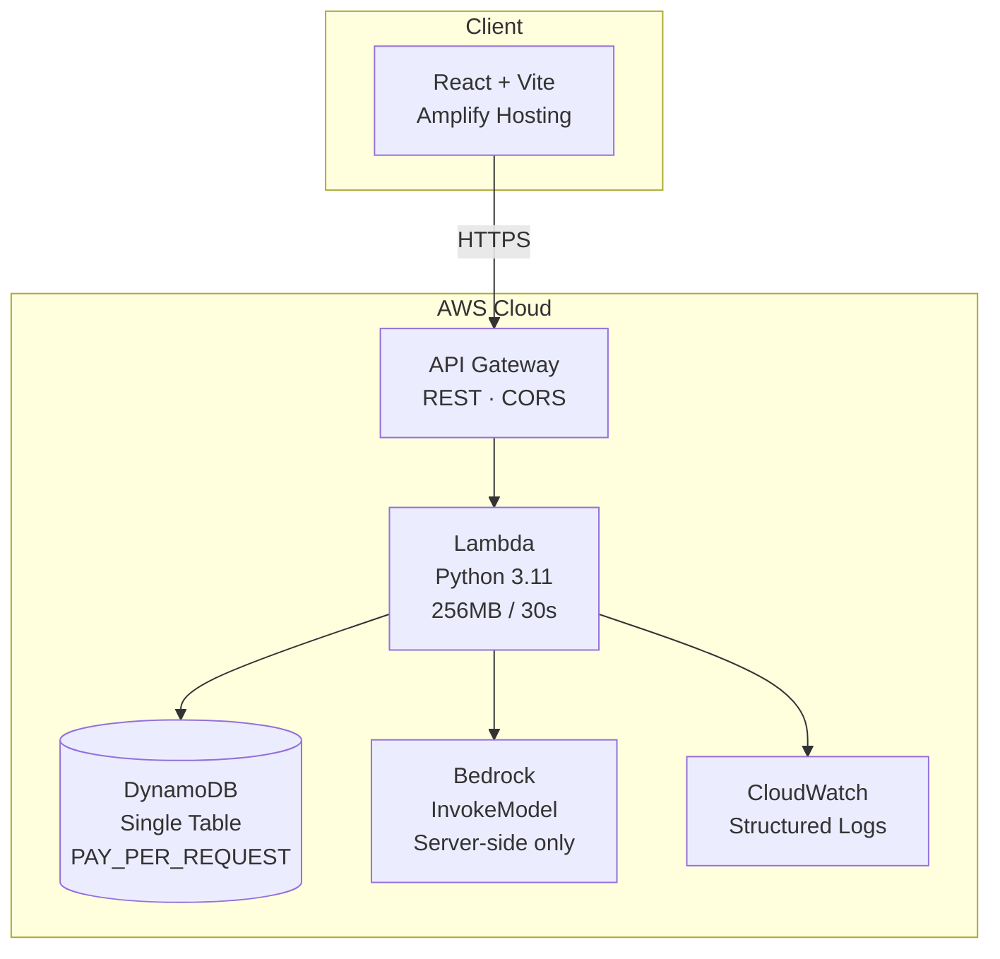
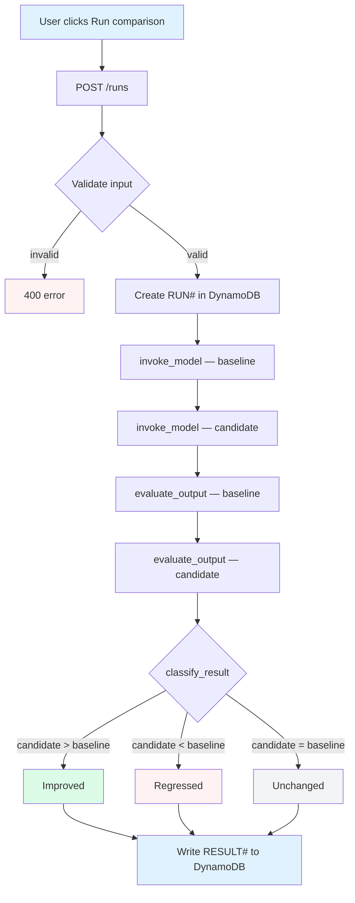
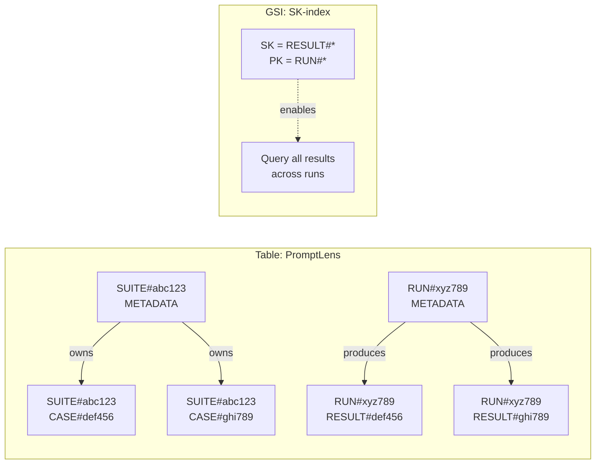
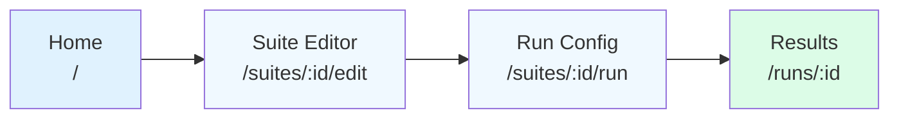

# PromptLens

A lightweight prompt-regression testing workspace for AI engineers. Compares two prompt versions against saved test cases, invokes Amazon Bedrock models, scores results against rubrics, and highlights regressions.

---

## Architecture



**Full reference:** [`docs/architecture.md`](docs/architecture.md)

---

## Data Flow

### Run Execution (per case)



> **4 Bedrock calls per case** × max 3 cases per run = **12 invocations max**

### DynamoDB Key Pattern



| PK | SK | Contains |
|----|----|----------|
| `SUITE#<id>` | `METADATA` | Suite name, timestamps |
| `SUITE#<id>` | `CASE#<id>` | Input, expected behavior, tags |
| `RUN#<id>` | `METADATA` | Model, prompts, rubric, status |
| `RUN#<id>` | `RESULT#<caseId>` | Outputs, scores, classification |

### Frontend Screens



---

## Quickstart

### Backend

```bash
cd backend
python3.11 -m venv .venv
.venv/bin/pip install -r requirements.txt
.venv/bin/python -m pytest tests/ -q          # 202 tests pass
```

### Frontend

```bash
cd frontend
npm install
cp .env.example .env    # set VITE_API_BASE_URL
npm run dev             # http://localhost:5173
```

### Seed demo data

```bash
cd backend
.venv/bin/python -m src.handlers.api.seed
```

Creates "Customer Support Replies" suite with 3 cases.

---

## Deploy to Production

### 1. Deploy backend (SAM)

```bash
cd backend
../sam build
../sam deploy --guided \
  --parameter-overrides AmplifyDomain=https://main.dXXXXXX.amplifyapp.com
```

Stack name: `promptlens`. Follow guided prompts.

### 2. Get the API endpoint

```bash
aws cloudformation describe-stacks --stack-name promptlens \
  --query "Stacks[0].Outputs[?OutputKey=='ApiEndpoint'].OutputValue" \
  --output text
```

### 3. Deploy frontend (Amplify)

1. Push repo to GitHub
2. AWS Amplify console → connect GitHub repo
3. Set env var `VITE_API_BASE_URL` = API endpoint from step 2
4. Deploy → Amplify provides public URL

### 4. Verify

```bash
curl <api-endpoint>/health
# Open Amplify URL → seeded demo should work end-to-end
```

---

## Validation Limits

| Parameter | Min | Max | Default |
|-----------|-----|-----|---------|
| `baselinePrompt` | — | 10,000 chars | required |
| `candidatePrompt` | — | 10,000 chars | required |
| `temperature` | 0.0 | 1.0 | 0.7 |
| `maxTokens` | 1 | 4,096 | 1,024 |
| `caseIds` per run | 1 | 3 | auto-select first 3 |

---

## Cost & Security

**Cost:** < $5/month for light usage (< 50 runs). Bedrock costs are model-dependent (Claude 3 Haiku is cheapest).

**Security:**
- No auth in MVP (post-MVP scope)
- No credentials in frontend — Bedrock invoked server-side only
- CORS restricted to Amplify domain via `AmplifyDomain` parameter
- CloudWatch logs contain IDs and sizes only — no raw prompts or outputs

---

## Cleanup

```bash
./sam delete --stack-name promptlens
```

---

## Further Reading

- [`docs/architecture.md`](docs/architecture.md) — full architecture reference (DynamoDB design, API endpoints, data models, security)
- [`docs/adr/0001-0004`](docs/adr/) — architecture decision records
- [`CONTEXT.md`](CONTEXT.md) — domain model glossary
- [`backend/README.md`](backend/README.md) — backend setup details
- [`frontend/README.md`](frontend/README.md) — frontend setup details
